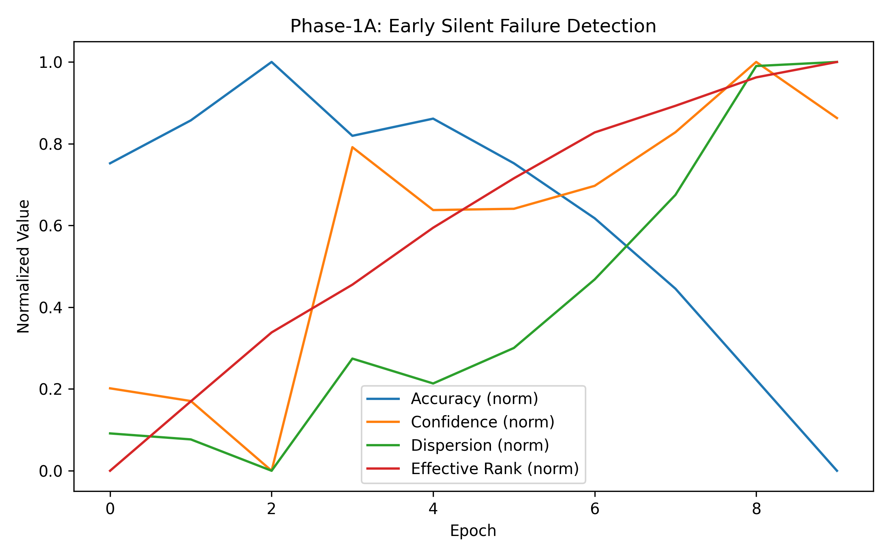
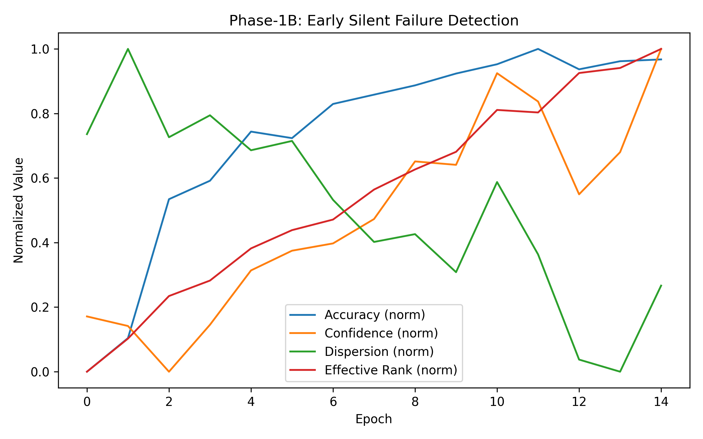
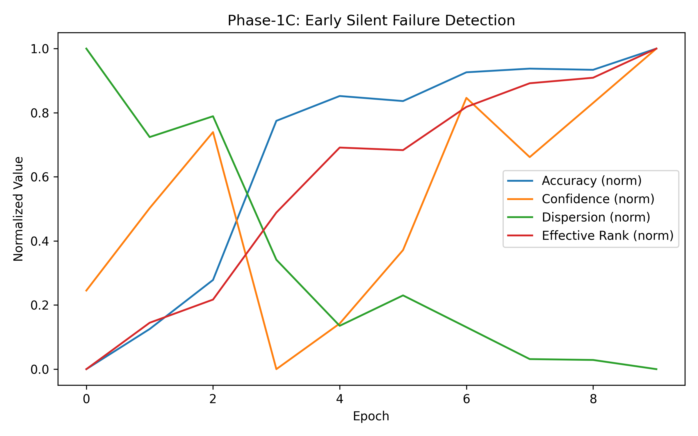

# Silent Failure Detection via Prediction Geometry

This repository contains the code and experiments for detecting silent failure in deep neural networks using prediction geometry.  
We show that geometric properties of latent representations can provide early warning signals of model failure, even when accuracy and confidence remain high.

Silent failure refers to scenarios where a model appears to perform well according to standard metrics, yet its internal representations degrade due to shortcut learning, spurious correlations, or distribution shift.

---

## Key Idea

Traditional monitoring signals such as accuracy and confidence often fail to detect early model degradation.

This project instead tracks representation geometry over training time, using:
- Embedding dispersion
- Effective rank of the representation space

These metrics are:
- model-agnostic  
- training-free  
- applicable during and after training  
- consistent across datasets, architectures, and failure modes  

---

##  Experimental Phases

### Phase-0 / Phase-1A: MNIST + Label Noise
- Simple CNN trained with increasing label noise
- Accuracy and confidence remain high initially
- Geometry metrics react earlier, revealing silent failure

### Phase-1B: CIFAR-10 + Spurious Correlation
- CNN trained with artificial spurious visual cues
- Accuracy and confidence improve steadily
- Geometry metrics expose shortcut learning and instability

### Phase-1C: Architecture & Robustness
- ResNet-18 trained on CIFAR-10
- Tested under distribution shift (OOD corruption)
- Geometry metrics generalize across architectures and OOD inputs
- No detector tuning required

---

## Results (Selected Figures)

### Phase-1A: MNIST + Label Noise

### Phase-1B: CIFAR-10 + Spurious Correlation

### Phase-1C: ResNet-18 + OOD Generalization

Observation:  
Across all phases, geometry metrics change earlier and more consistently than accuracy or confidence.

---

## Repository Structure

silent-failure-geometry/
├─ README.md
├─ requirements.txt
├─ .gitignore
├─ run_all.py
├─ figures/
├─ scripts/
└─ src/

- `src/` contains all models, training code, geometry metrics, and plotting logic  
- `scripts/` contains Windows batch files for reproducible execution  
- `figures/` contains selected result plots for documentation  
- `results/` and `checkpoints/` are generated locally and gitignored  

---

## Setup

### Create a virtual environment

Windows:

python -m venv .venv 
.\.venv\Scripts\activate

Linux / macOS:

python3 -m venv .venv
source .venv/bin/activate

### Install dependencies
pip install -r requirements.txt

---

## Running the Experiments

### Run all phases
python run_all.py

### Run individual phases (Windows)
scripts\run_phase0.bat
scripts\run_phase1a.bat
scripts\run_phase1b.bat
scripts\run_phase1c.bat

Each phase:
1. Trains the model
2. Extracts embeddings per epoch
3. Computes geometry metrics
4. Generates plots

---

##  Notes on Reproducibility

- Datasets (MNIST, CIFAR-10) are downloaded automatically
- Checkpoints and embeddings are not committed
- All results can be regenerated by running the scripts
- Geometry metrics remain unchanged across all phases

---

## Relation to Prior Work

This work is complementary to training-time debugging frameworks that detect silent errors in the training process.  
Instead, this project focuses on detecting representation-level failure that can arise even when training is correct and accuracy remains high.

---

## Contact

If you have questions or would like to discuss this work, feel free to open an issue on GitHub.

---

If you find this work useful, consider starring the repository.

